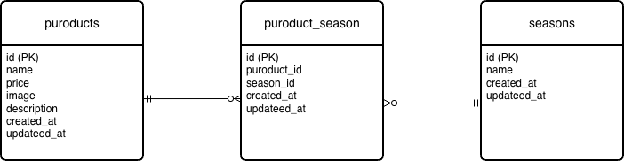

# mogitate

フルーツ商品を管理・表示するための **Laravel製Webアプリケーション**です。  
商品一覧表示・検索・登録・編集・削除などの基本的なCRUD機能を実装しています。

---

## 🌱 アプリケーション名

**mogitate**

「新鮮なフルーツを扱うアプリケーション」をイメージして命名しました。

---

## 🚀 環境構築手順

### 1. リポジトリをクローン

```bash
git clone https://github.com/rikutomashio/mogitate.git
cd mogitate
```

### 2. Dockerコンテナをビルド・起動

```bash
docker-compose build
docker-compose up -d
```

### 3. 依存関係をインストール

```bash
docker-compose exec php composer install
```

### 4. 環境変数を設定

```bash
docker-compose exec php cp .env.example .env
docker-compose exec php php artisan key:generate
```

### 5. マイグレーション & シーディング

```bash
docker-compose exec php php artisan migrate --seed
```

### 6. シンボリックリンク作成（画像表示用）

```bash
docker-compose exec php php artisan storage:link
```

### 7. ブラウザでアクセス

http://localhost/products

---

### 使用技術

バックエンド

・PHP 8.4

・Laravel 12

フロントエンド

・Blade

・CSS / Bootstrap

データベース

・MySQL

---

### 開発環境

・Docker

・Docker Compose

---

### ER図



### URL（ローカル環境）

・http://localhost/products

・http://localhost:8080
